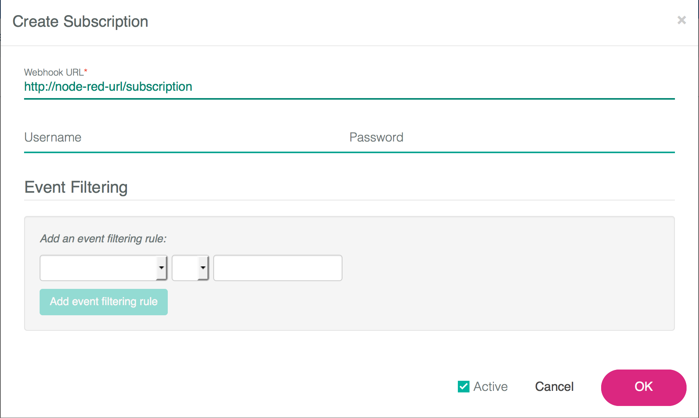

# MobileFirst Platform - Presence Insights Eventing with Node-RED

## Overview

Once Presence Insights has been fully set up it can be useful to see what data it is collecting. The best way to do this is to set up a subscription in Presence Insights and use that subscription to display all the events, such as a device entering, exiting, or dwelling in a zone, that it collects.

The first step in setting up a subscription is to have an endpoint for that subscription. This guide will show you how to use Node-RED as that enpoint and how to have Node-RED display every Presence Insights event.

## Setting up Node-RED

On the [Node-RED documentation page](https://www.stage1.ng.bluemix.net/docs/starters/Node-RED/nodered.html) follow the steps for outlined in **Usage**. Do not worry about anything after that, we do not have to do any customization.

Navigate to the Node-RED url and click on the button on the top right and select **Import** and then **Clipboard**. In the popup paste the code below:

	[{"id":"93ddcd78.41f28","type":"http in","name":"Input","url":"/subscription","method":"post","swaggerDoc":"","x":104,"y":506,"z":"5d484b02.1cb934","wires":[["9c2adda8.5d1928"]]},{"id":"634784df.e5fc0c","type":"debug","name":"","active":true,"console":"false","complete":"true","x":504,"y":515,"z":"5d484b02.1cb934","wires":[]},{"id":"9c2adda8.5d1928","type":"function","name":"return","func":"return msg.payload;","outputs":1,"noerr":0,"x":314,"y":534,"z":"5d484b02.1cb934","wires":[["634784df.e5fc0c"]]}]
	
Select **OK** and place the new nodes in your workspace. Hit the red **Deploy** button on the top right.

## Setting up Presence Insights

[This guide](https://presenceinsights.ibmcloud.com/pidocs/configure/subscriptions) will guide you in setting up a subscription in Presence Insights. Before clicking **OK** make sure the subscriptionpopup box has the following configuration 

where the string `Node-RED-url` is replaced by the url you set up for your Node-RED app.

Once that is done, navigate back your Node-RED app, click on the debug tab, and watch the events start coming in.

## Customization

The code from this guide produces output that is sometimes too large to fully display in the Node-RED debug panel. To fix this double click on the **return** node to open up the editor. Below is an example of another way to output events.

	// An example of how to cut down the message output
	return msg.payload.device.name + 
	    ", RSSI: " + msg.payload.rssi + 
	    ", zone: " + msg.payload.zone.name + 
	    ", event: " + msg.payload.activity;
	
To test this, remove all the code from the **return** node and replace it with the code above.

This is just one example of outputting events. The following image shows all the data that a Presence Insights subscription will output. 

Appending the any of those options to the string `msg.payload.` will add that item to the event output. For example, to see only the floor the device is on, use the code 
	
	return msg.payload.floor.name;
===

Copyright 2015 IBM Corp.

Licensed under the Apache License, Version 2.0 (the "License"); you may not use this file except in compliance with the License. You may obtain a copy of the License at http://www.apache.org/licenses/LICENSE-2.0 

Unless required by applicable law or agreed to in writing, software distributed under the License is distributed on an "AS IS" BASIS, WITHOUT WARRANTIES OR CONDITIONS OF ANY KIND, either express or implied. See the License for the specific language governing permissions and limitations under the License.
